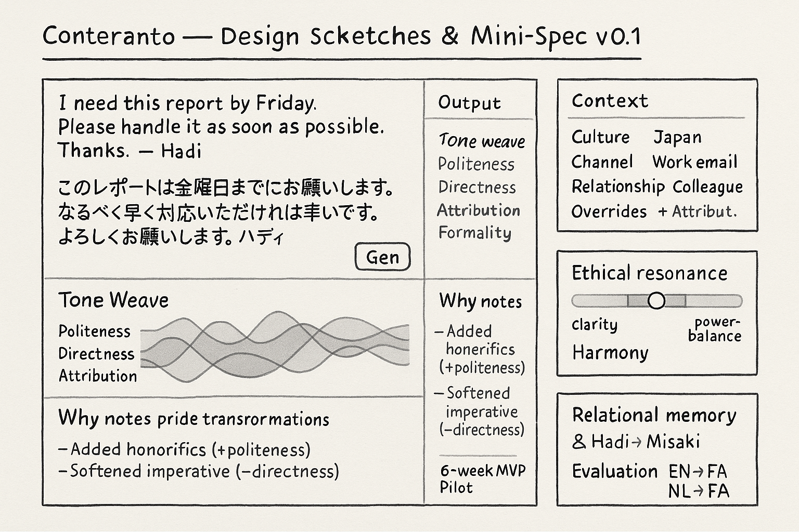

<div align="center">

# Conteranto — Context-Aware Cultural Translation




*Public website of the Conteranto project — translation that truly understands people, not just their words.*

**Live site: [conteranto.com](https://conteranto.com)**

</div>

## Overview

Conteranto is a translation system that adds a **cultural-context layer** on top of large language models. Where conventional machine translation optimizes only for linguistic accuracy, Conteranto also adapts *how* things are said — adjusting politeness, formality, and intimacy to the norms of the target language and the communication context, with live explanations of why each adjustment matters.

This repository contains the project's public website: a dependency-free static site presenting the problem, the approach, the research behind it, and the project's outcomes. The interactive demo application is deployed separately at [app.conteranto.com](https://app.conteranto.com).

## The Problem

Machine translation has made enormous progress in accuracy, yet it still struggles with *how* things are said. Politeness, formality, and personal tone are not mere stylistic choices — they carry cultural meaning:

- A phrase that sounds neutral in English may come across as blunt or offensive in Persian if translated too directly.
- A polite Dutch request can become unnecessarily formal in Japanese if tone is not adapted.
- Today's tools deliver one-size-fits-all output, ignoring these cultural dimensions.

## The Approach

Conteranto generates translations that respect cultural communication norms through three user-controllable style dimensions:

1. **Politeness** — adjust the respect level from casual to highly respectful
2. **Formality** — adapt the register from informal everyday speech to formal professional tone
3. **Intimacy** — control how personal or distant the tone feels

Around these dimensions the system provides smart per-language defaults, fine-grained user control with instant feedback, and live explanations of why each adjustment matters in the target culture.

## Tech Stack

- **HTML5** single-page site with semantic markup
- **Modular CSS** — `main.css` imports module and section stylesheets (Grid, Flexbox, custom properties)
- **ES6 JavaScript modules** — pure vanilla JS, no frameworks, no build step
- **Google Fonts** (Inter and Space Grotesk) as the only external dependency
- **GitHub Pages** hosting with a custom apex domain via `CNAME`

## Repository Structure

```
Conteranto.github.io/
├── index.html              # Single-page website (all sections)
├── CNAME                   # Custom domain: conteranto.com
├── LICENSE                 # MIT
└── assets/
    ├── css/
    │   ├── main.css        # Entry point (imports all modules)
    │   ├── modules/        # base, layout, components, navigation
    │   └── sections/       # hero, research, methodology, demo, other sections
    ├── js/
    │   ├── main.js         # Entry point (ES6 modules)
    │   └── modules/        # navigation, interactive, animations, utils
    └── images/             # Logos, icons, favicon, social-sharing image, artwork
```

## Local Preview

No build step is required — serve the directory with any static file server:

```bash
# Python
python3 -m http.server 8000

# or Node.js
npx http-server -p 8000
```

Then open `http://localhost:8000`. Opening `index.html` directly in a browser also works, though ES-module loading behaves best over a local server.

## Deployment

The site is served by GitHub Pages from the root of the `main` branch, with the custom apex domain `conteranto.com` configured via the `CNAME` file. Every push to `main` deploys automatically:

```bash
git push origin main
# Live at https://conteranto.com within a minute or two
```

## About the Project

Conteranto is an academic research project of Utrecht University in collaboration with AcademicTransfer. Found a problem with the website or have a suggestion? Please open an issue on this repository.

## License

MIT — see [LICENSE](LICENSE).

## Maintainer

**Hadi Mohammadi** — [mohammadi.cv](https://mohammadi.cv)
